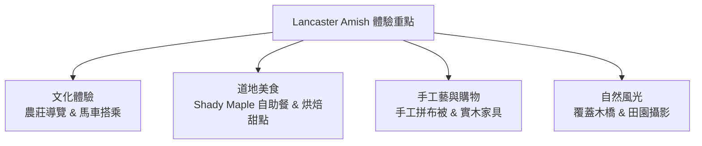

# 🚜 賓夕法尼亞州蘭開斯特：阿米什農莊 (Lancaster Amish Country) 深度文化與旅遊指南

從華盛頓 D.C. 驅車向北約 2 小時（或從費城驅車約 1.5 小時），就會抵達賓夕法尼亞州的**蘭開斯特郡 (Lancaster County)**。這裡是全美國歷史最悠久、規模最大的**阿米什人 (Amish)** 聚落。

進入 Lancaster，彷彿穿越時空流轉回到了 18 世紀——沒有高壓電線、沒有霓虹燈與現代汽車聲，取而代之的是綠意盎然的丘陵農田、風車、木造覆蓋橋 (Covered Bridges)，以及路上嗒嗒作響的黑頂**馬車 (Horse-drawn Buggy)**。

---

## 📜 一、 阿米什人 (Amish) 是誰？生活文化背景

阿米什人是 18 世紀為逃避歐洲宗教迫害，從瑞士與德意志南部移民至美國賓州的重洗派 (Anabaptist) 基督徒。

* **拒絕現代科技**：他們堅守「簡樸 (Simplicity)」與「遠離世俗虛榮」的信仰理念，不接入公共電網（使用丙烷、汽油發電機或水力），不擁有私人汽車、電視與智慧型手機。
* **傳統服飾**：男士戴寬邊草帽/黑帽、穿吊帶褲與無鈕扣外套，成年留鬍鬚；女士身穿素色長裙、頭戴白色或黑色布帽 (Bonnet)，不佩戴任何首飾。
* **語言**：平時族群內部使用特殊的**賓州德語 (Pennsylvania Dutch)**，對外則能說流利的英語。
* **集體互助 (Barn Raising)**：阿米什社區極度重視家庭與鄰里互助，若有人家遭火災或需建造大木廄，全鎮上百位男丁會在一兩天內合力用手作方式搭建完畢。

---

## 🌟 二、 阿米什農莊必體驗亮點

### 1. 參觀真實阿米什家園 (The Amish Farm and House / Amish Village)
* **體驗項目**：參加官方導覽，走進真實的阿米什歷史住宅與農場。導覽員會詳細介紹他們如何不用電料理食物、如何用壓力和氣泵運作洗衣機，以及孩子們在一間教室 (One-room schoolhouse) 裡上課的情形。
* **農場動物互動**：場內可親近馬、羊、牛與農場小動物，非常適合夫妻倆悠閒漫步。

### 2. 搭乘傳統黑頂馬車 (Amish Buggy Ride)
* **體驗地點**：如 *AAA Buggy Rides* 或 *Aaron and Jessica's Buggy Rides*。
* **體驗內容**：由傳統阿米什或在地車夫駕駛馬車，帶您駛離繁忙幹道，穿過充滿風車與玉蜀黍田的鄉間小路，甚至途經百年歷史的木造覆蓋橋 (Covered Bridge)，車夫會沿途講述阿米什人的農耕與日常生活。

### 3. 品嚐阿米什傳統家庭大餐 (Amish Smorgasbord & Bakery)
阿米什人的烘焙與家常菜以**「用料實在、純手工製作、美味飽足」**享譽全美：
* 🍗 **Shady Maple Smorgasbord（必去！全美最大自助餐廳）**：
  * 這座餐廳規模震撼，提供上百道阿米什與賓州德式家常料理，包括現烤爐烤牛肉、炸雞、各式新鮮蔬果、手工派餅與起司。
* 🥧 **道地甜點與小吃**：
  * **Shoofly Pie（糖蜜派）**： Lancaster 標誌性甜點，以黑糖蜜與麵屑烘烤，香濃甜美。
  * **Soft Pretzel（手工軟椒鹽捲餅）**：剛出爐沾上融化奶油，外酥內軟。
  * **Whoopie Pie（烏比派）**：兩片鬆軟巧克力蛋糕夾著濃郁奶油餡。

### 4. 國寶級手工藝品：拼布被 (Quilts) 與實木家具
* **Amish Quilts（手工拼布被）**：阿米什婦女手工縫製的拼布被被譽為美國民間藝術瑰寶，幾何圖案精緻、針腳極為細密，耐用數十年。
* **手工實木家具**：採用優質橡木、楓木，不使用釘子而採用傳統榫卯結構，堅固耐用。

---

## 🚫 三、 參觀阿米什社區的禮儀與禁忌（極重要！）

1. **切勿正對阿米什人的面部拍照**：
   * 根據阿米什人的宗教教義（十誡第二誡「不可雕刻偶像」），他們認為拍攝個人肖像會引發個人的傲慢與虛榮。
   * **禮儀規定**：可以拍攝風景、遠處的馬車或農舍，但**絕不能拿相機/手機對著阿米什人的臉部（特別是兒童）近距離拍照**。
2. **週日店家公休 (Sunday Rest)**：
   * 阿米什人嚴格遵守主日安息，**所有的阿米什農夫市場、手作店、烘焙坊與農莊體驗在星期日完全不營業**！
   * **建議行程時間**：安排在 **星期四、五、六** 造訪最為合適。
3. **開車行車安全**：
   * 在鄉間小路開車時若遇到馬車，請減速慢行並保持距離；**切勿按喇叭**，以免驚嚇馬匹。

---

## 🗺️ 四、 2天1夜 (或 3天2夜聯遊) 建議路線

### 方案 A：Lancaster 阿米什農莊 + 長木花園 2天1夜
* **Day 1**：
  * 08:30 從 D.C. 驅車出發（約 2 小時）抵達 Lancaster。
  * 10:30 參觀 【The Amish Farm and House】了解文化與生活。
  * 12:30 搭乘 【Amish Buggy Ride】鄉間馬車之旅。
  * 14:00 逛 【Bird-in-Hand Farmers Market】買手作果醬、軟餅乾與拼布。
  * 17:30 享用著名的 【Shady Maple Smorgasbord】豪華自助晚餐。
  * 宿：Lancaster 鄉村風格飯店或 B&B。
* **Day 2**：
  * 09:00 前往全美頂級植物園【長木花園 (Longwood Gardens)】（車程約 40 分鐘），欣賞巨型溫室、噴泉水舞與初秋花卉。
  * 14:30 享用精緻午餐後，驅車返回華盛頓 D.C.（或續前往費城）。

---

這份阿米什農莊專題指南已寫入您的系統檔案中，並已同步更新至您的 **桌面 `ai` 資料夾** 與 **Word 文件** 中！
