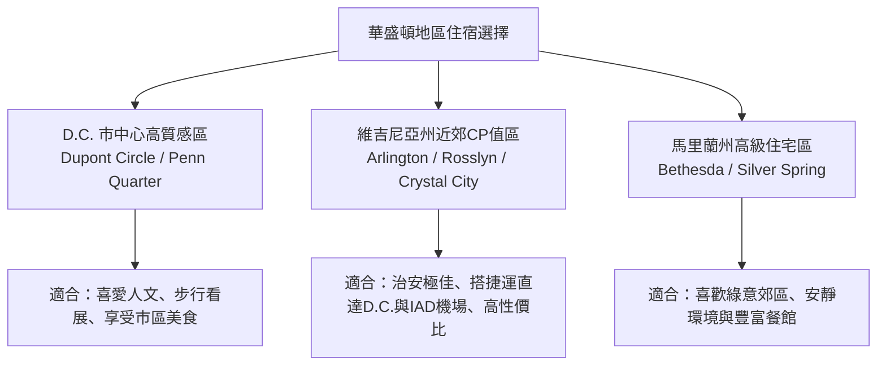

# 🏨 華盛頓 D.C. 探親與旅遊住宿全攻略 (分區推薦、長住公寓與飯店精選)

前往華盛頓 D.C. 進行長達 18 天的探親與觀光，**選擇合適的住宿區域與房型**將大幅提升行程的舒適度。由於隨行有先生且停留時間較長，建議優先考慮 **「安全第一、捷運便利、環境安靜」**，並可適度搭配 **「附設廚房與洗衣機的長住型公寓飯店 (Extended Stay / Sonder)」**。

---

## 📍 一、 四大核心住宿區域評比與飯店推薦

---

### 1. Dupont Circle / Logan Circle（D.C. 市中心 · 人文治安最佳首選）
* **環境特點**：華盛頓傳統的高級住宅與大使館區，林立著樹蔭大道、維多利亞風格紅磚房、獨立咖啡館與藝廊，晚上漫步極為安全且氣氛優雅。
* **交通便利**：捷運 **紅線 (Red Line)** Dupont Circle 站，可直達國會山莊、聯合車站與 Bethesda。
* **推薦飯店/公寓**：
  * 🏨 **The Dupont Circle Hotel**：地標級精品飯店，房間時尚溫馨，服務極佳。
  * 🏨 **Tabard Inn**：充滿歷史風情與溫馨感的小型旅店，附設極受好評的早餐。
  * 🏡 **Sonder at Dupont Circle**：酒店式服務公寓，附設完整廚房與洗乾衣機，非常適合長住。
  * 🏨 **Residence Inn by Marriott Dupont Circle**：萬豪旗下長住飯店，含免費熱早餐，房內有微波爐、冰箱與簡易廚房。

---

### 2. Penn Quarter / Chinatown（D.C. 市中心 · 博物館與景點核心）
* **環境特點**：緊鄰國家廣場 (National Mall)，絕大多數史密森尼博物館、國會大廈與著名餐廳都在步行範圍內。
* **交通便利**：捷運 **Metro Center** 與 **Gallery Place** 大站，紅/黃/綠/藍/橙/銀多線交會，全 D.C. 交通最方便之處。
* **推薦飯店**：
  * 🏨 **Grand Hyatt Washington**：大型四星飯店，直通捷運站地下通道，設施完善。
  * 🏨 **Courtyard by Marriott Downtown / Convention Center**：極新穎的飯店，頂樓露台景觀極佳。
  * 🏨 **Riggs Washington DC**：由 historic bank 改造的奢華精品飯店，建築與設計極具質感。

---

### 3. Arlington - Rosslyn / Crystal City（維吉尼亞州 · CP值與安全性最高）
* **環境特點**：位於波托马克河對岸，治安極優、街區乾淨且現代化。房價與飯店稅率比 D.C. 市區划算約 15%~25%。
* **交通便利**：
  * **Rosslyn 站**：捷運藍/橙/銀線，搭乘 1 站即達 Georgetown（喬治城），15 分鐘直達市中心。銀線更可 **直達 IAD 杜勒斯機場**。
  * **Crystal City / Pentagon City 站**：捷運黃/藍線，直達 DCA 里根機場與 D.C. 市區。
* **推薦飯店/長住**：
  * 🏨 **Hyatt Centric Arlington (Rosslyn)**：緊鄰 Rosslyn 捷運站出口，房間大、展望極佳。
  * 🏡 **Residence Inn by Marriott Arlington Rosslyn**：套房式長住飯店，房內設有完整廚房，免費提供每日熱早餐。
  * 🏨 **Crystal Gateway Marriott**：連接地下街與捷運站，雨天完全不需走戶外。

---

### 4. Bethesda（馬里蘭州 · 治安絕佳的高級郊區）
* **環境特點**：馬里蘭州富裕住宅區，周邊擁有超過 200 家各式餐館與精緻超市（如 Whole Foods, Trader Joe's），非常適合喜愛安靜生活品質的長輩。
* **交通便利**：捷運 **紅線 (Red Line)** 直達 D.C. 市中心與國家動物園。
* **推薦飯店**：
  * 🏨 **AC Hotel by Marriott Bethesda Downtown**：新穎簡約的西班牙現代風格飯店。
  * 🏨 **The Bethesdan Hotel (Tapestry Collection by Hilton)**：環境安靜、服務親切。

---

## 🍳 二、 18 天長住型房型評比：飯店 vs. 公寓式飯店 (Extended Stay / Sonder)

對於停留 18 天的旅客，**非常推薦部分或全程選擇「公寓式飯店 (Extended Stay Hotels / Serviced Apartments)」**：

| 房型種類 | 代表品牌 | 房內設備 | 優勢 | 適合情境 |
| :--- | :--- | :--- | :--- | :--- |
| **長住型套房飯店** | Residence Inn Homewood Suites Element by Westin | 全套廚房（電磁爐、大冰箱、微波爐、洗碗機）、洗乾衣房 | 免費熱早餐、每日清潔、有前台服務安全高 | 夫妻雙人長住、想偶爾自己煮家鄉菜 |
| **酒店式服務公寓** | Sonder Mint House | 獨立廚房、房內洗乾衣機、客廳與用餐區 | 空間大（像住家裡）、裝潢現代、可做飯洗衣服 | 停留超過 7 天以上、享受極度隱私 |
| **傳統星級飯店** | Hyatt, Marriott, Hilton | 小冰箱、咖啡機（無廚房） | 服務無微不至、禮賓接待 | 前 3-5 天或行程最後幾天 |

---

## 💡 三、 訂房省錢與注意事項

1. **住宿稅率差異**：
   * D.C. 市內飯店稅率高達 **15.95%**。
   * 維吉尼亞州 Arlington 飯店稅率約 **14.25%**，整體消費較划算。
2. **長住折扣 (Weekly / Long Stay Rate)**：
   * 許多長住飯店（如 Residence Inn）或 Sonder 公寓，預訂 **7 晚以上** 或 **14 晚以上** 會自動提供 10%~20% 的長住折扣。
3. **停車費考量**：
   * 若有租車，D.C. 市中心飯店的過夜停車費高達 **$50~$75 美金/晚**。
   * 若預計租車，建議選擇 Arlington 或 Bethesda 飯店（停車費約 $25~$30/晚，甚至部分郊區飯店提供免費停車）。
4. **與女兒住處的距離**：
   * 訂房前可先確認女兒住在 D.C. 市區、維吉尼亞州還是馬里蘭州，選擇 **同一條捷運路線 (Metro Line)** 的飯店，往返聚會最方便！
