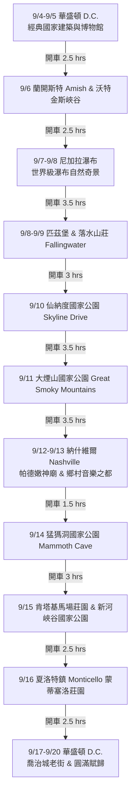

# 🇺🇸 美國東岸雙向自然與建築巡禮 17 天公路旅行指南
**日期**：9/4 – 9/20（共 17 天）  
**主要站點**：華盛頓特區（Washington D.C.）⚡️ 尼加拉瀑布（Niagara Falls）⚡️ 納什維爾（Nashville）  
**行程特色**：控制每日開車時數於 **2～4 小時**，絕不拉拉長途車，結合世界級自然景觀（瀑布、國家公園、地下洞穴）與頂級建築美學（古典神廟、落水山莊、新古典主義世界遺產）。

**預算控管**：全程每晚住宿預算嚴格控制於 **$300 美金以內（含稅金與過夜停車費）**。

---

## 🏨 美東自然之旅全行程 $300 美金/晚 住宿總覽表

| 行程站點與分區 | 推薦住宿與飯店品牌 | 每晚預估未稅房價 | 每晚預估含稅/停車總價 | 住宿特色與優勢 |
| :--- | :--- | :--- | :--- | :--- |
| **1. 華盛頓 D.C. / Arlington** *(Day 1-2, Day 14-17)* | **Residence Inn Arlington Rosslyn** **Hyatt Centric Arlington** | $180 - $250 | **$215 - $285 /晚** | 捷運 Rosslyn 站口，銀線直達 IAD 機場，附廚房與免費熱早餐。 |
| **2. 指湖區 Finger Lakes** *(Day 3)* | **Watkins Glen Harbor Hotel** **Ithaca Marriott Downtown** | $170 - $240 | **$195 - $275 /晚** | 位於 Seneca 湖畔或 Ithaca 大學城，漫步峽谷步道極方便。 |
| **3. 尼加拉瀑布 Niagara Falls** *(Day 4)* | **Hyatt Place Niagara Falls** **Seneca Niagara Resort** | $160 - $235 | **$185 - $270 /晚** | 步行可達霧中少女號觀光船碼頭與風之穴，包含過夜停車。 |
| **4. 匹茲堡 Pittsburgh** *(Day 5)* | **The Industrialist Hotel** **Kimpton Hotel Monaco** | $160 - $230 | **$188 - $268 /晚** | 市中心頂級精品飯店，近纜車與三河夜景，便利走訪落水山莊。 |
| **5. 仙納度國家公園 Shenandoah** *(Day 6-7)* | **Skyland Lodge (公園內小木屋)** **The Mimslyn Inn (Luray)** | $150 - $220 | **$172 - $252 /晚** | 位於天際線公路最高處，看無敵山谷夕陽；或入住 Luray 溫馨小鎮。 |
| **6. 大煙山國家公園 Smoky Mountains** *(Day 8)* | **Peaks of Otter Lodge (藍嶺)** **Highland Manor Inn (Townsend)** | $130 - $200 | **$148 - $228 /晚** | 湖畔野生自然木屋，避開人潮，早晨常有晨霧與野生白尾鹿。 |
| **7. 納什維爾 Nashville** *(Day 9-10)* | **Hyatt House Nashville Downtown** **Element Nashville Music Row** | $170 - $245 | **$198 - $285 /晚** | 附微波爐與廚房，步行可至帕德嫩神廟與 Broadway 音樂老街。 |
| **8. 肯塔基藍草 & 猛獁洞** *(Day 11)* | **21c Museum Hotel Lexington** **The Campbell House** | $150 - $220 | **$174 - $254 /晚** | 現代藝術博物館風格飯店，充滿藍草馬場奢華莊園風情。 |
| **9. 新河峽谷國家公園** *(Day 12)* | **The Lafayette Hotel (Fayetteville)** **Quality Inn New River Gorge** | $110 - $170 | **$125 - $195 /晚** | 位於國家公園大本營 Fayetteville 小鎮，CP 值極高且氛圍放鬆。 |
| **10. 夏洛特鎮 Charlottesville** *(Day 13)* | **The Draftsman Charlottesville** **Boar's Head Resort** | $170 - $245 | **$195 - $282 /晚** | 維吉尼亞大學旁精品飯店，方便次日造訪蒙蒂塞洛世界遺產莊園。 |

---

## 🗺️ 路線總覽圖 (Route Overview)

---

## 🚘 每日行程詳細規劃 (Day-by-Day Itinerary)

### Day 1: 9/4 (三) 抵達華盛頓 D.C. — 輕鬆啟程
* **每日開車時數**：0.5 – 1 小時（機場至飯店）
* **行程亮點**：抵達 D.C. 取車入住，晚間沿波托馬克河畔（The Wharf）散步，享用海鮮晚餐。
* **住宿建議**：Arlington / Alexandria（維吉尼亞側，停車方便且品質高）或 DuPont Circle。

### Day 2: 9/5 (四) 華盛頓 D.C. — 國家建築與古典美學巡禮
* **每日開車時數**：0 小時（建議搭乘地鐵或 Uber）
* **景點介紹**：
  * 🏛️ **美國國會大廈 (U.S. Capitol)**：新古典主義圓頂建築典範。
  * 🏛️ **林肯紀念堂 (Lincoln Memorial) & 反映池**：仿古希臘多立克柱式神廟。
  * 🎨 **美國國家藝廊 (National Gallery of Art)**：東西展館交織古典與貝聿銘現代幾何建築。
* **住宿建議**：同 Day 1。

### Day 3: 9/6 (五) D.C. ➔ 賓州阿米什農莊 ➔ 指湖區峽谷
* **每日開車時數**：~4.5 小時（分為兩段：D.C. ➔ Lancaster 2 hrs，Lancaster ➔ Finger Lakes 2.5 hrs）
* **景點介紹**：
  * 🌾 **Lancaster Amish Country**：探訪保留 19 世紀傳統無電無車生活的阿米什村莊與覆蓋木橋（Covered Bridge）。
  * 🌲 **Watkins Glen State Park (沃特金斯格倫州立公園)**：著名的 Gorge Trail 峽谷步道，沿途穿越 19 座連綿瀑布與千層岩層。
* **住宿建議**：Ithaca 或 Watkins Glen 湖畔渡假旅館。

### Day 4: 9/7 (六) 指湖區 ➔ 尼加拉瀑布（美國側 + 加拿大側視角）
* **每日開車時數**：~2.5 小時
* **景點介紹**：
  * 💦 **霧中少女號 (Maid of the Mist)**：搭乘觀光船直衝瀑布馬蹄灣下方，感受震撼水霧。
  * 🌊 **風之穴 (Cave of the Winds)**：穿上黃色雨衣走上木棧道，零距離體驗新娘面紗瀑布的磅礡衝擊。
  * 🇨🇦 **Goat Island (羊島) & 三姊妹島**：漫步於瀑布頂端公園。
* **住宿建議**：Niagara Falls (NY) 飯店或 Grand Island 渡假飯店。

### Day 5: 9/8 (日) 尼加拉瀑布 ➔ 匹茲堡（鋼鐵城與文化藝術）
* **每日開車時數**：~3.5 小時
* **景點介紹**：
  * 🌉 **Duquesne Incline 纜車**：搭乘百年木造纜車登上 Mount Washington，俯瞰三河交匯的匹茲堡天際線與鋼鐵大橋。
  * 🌿 **Phipps Conservatory**：維多利亞時代溫室建築與精緻植物園。
* **住宿建議**：Pittsburgh Downtown 或 Laurel Highlands 鄉村山莊。

### Day 6: 9/9 (一) 匹茲堡 ➔ 建築史奇蹟【落水山莊】➔ 仙納度山谷
* **每日開車時數**：~3.5 小時
* **景點介紹**：
  * 🏡 **Fallingwater (落水山莊)**：建築大師法蘭克·勞埃德·萊特（Frank Lloyd Wright）的世界遺產傑作。建築直接懸空架設於溪流與瀑布之上，將有機建築與自然景觀融為一體（需提前預約門票）。
* **住宿建議**：Harrisonburg 或 Luray（仙納度國家公園入口旁）。

### Day 7: 9/10 (二) 仙納度國家公園（Skyline Drive）➔ 藍嶺山脈
* **每日開車時數**：~3 小時（皆為美景景觀公路慢駕）
* **景點介紹**：
  * ⛰️ **天際線公路 (Skyline Drive)**：穿越阿帕拉契山脈脊梁，沿途數十個觀景台，俯瞰仙納度山谷的壯麗綠林與初秋微紅景致。
  * 🥾 **Dark Hollow Falls Trail**：短巧舒適的瀑布森林步道。
* **住宿建議**：Roanoke 或 Radford (維吉尼亞山城)。

### Day 8: 9/11 (三) 藍嶺山脈 ➔ 大煙山國家公園（Great Smoky Mountains）
* **每日開車時數**：~3.5 小時
* **景點介紹**：
  * 🌫️ **Great Smoky Mountains National Park**：全美訪問量第一的國家公園，以常年繚繞藍藍晨霧的山巒著稱。
  * 🦌 **Cades Cove**：開車環形小徑，極高機會野生觀察黑熊、白尾鹿與野生火雞。
* **住宿建議**：Townsend（幽靜山城，極適合放鬆）或 Gatlinburg。

### Day 9: 9/12 (四) 大煙山最高峰 ➔ 納什維爾（Nashville）
* **每日開車時數**：~3.5 小時
* **景點介紹**：
  * ⛰️ **Clingmans Dome (克林曼峰)**：大煙山最高點，站在圓形觀景台上擁有一望無際的 360 度山脈雲海景色。
  * 🎸 **Nashville Broadway 夜景**：前往音樂之都，感受溫馨放鬆的 Live Music 氛圍。
* **住宿建議**：Nashville Downtown / Music Row 區域。

### Day 10: 9/13 (五) 納什維爾 — 復刻神廟與音樂文化
* **每日開車時數**：~0.5 小時（市區漫遊）
* **景點介紹**：
  * 🏛️ **納什維爾帕德嫩神廟 (The Parthenon)**：全球唯一 1:1 完全比例復刻的雅典帕德嫩神廟，館內供奉高達 13 公尺金碧輝煌的雅典娜巨像。
  * 🎵 **Ryman Auditorium & 鄉村音樂名人堂**：美國歷史悠久的音樂教堂建築。
* **住宿建議**：同 Day 9。

### Day 11: 9/14 (六) 納什維爾 ➔ 猛獁洞國家公園 ➔ 肯塔基藍草高原
* **每日開車時數**：~3 小時
* **景點介紹**：
  * 🦇 **Mammoth Cave National Park (猛獁洞國家公園)**：聯合國教科文組織世界遺產，擁有全球已知最長的地下洞穴系統（建議預約 Domes & Dripstones 或 Historic Tour）。
* **住宿建議**：Lexington (肯塔基州馬場之都，風景極美)。

### Day 12: 9/15 (日) 肯塔基馬場 ➔ 新河峽谷國家公園（New River Gorge）
* **每日開車時數**：~3.5 小時
* **景點介紹**：
  * 🐎 **Kentucky Horse Park**：圍欄綠草千畝的馬場景致。
  * 🌉 **New River Gorge National Park**：美國最年輕的國家公園之一！擁有北美第二高單跨鋼拱橋（New River Gorge Bridge），絕壁與古老河流相映成趣。
* **住宿建議**：Fayetteville 或 Beckley (西維吉尼亞州)。

### Day 13: 9/16 (一) 新河峽谷 ➔ 夏洛特鎮（總統府邸與世界遺產）
* **每日開車時數**：~3 小時
* **景點介紹**：
  * 🏰 **Monticello (蒙蒂塞洛莊園)**：美國開國元勳湯瑪斯·傑佛遜自行設計的莊園，獨特的圓頂與新古典主義建築，名列世界文化遺產。
  * 🏫 **University of Virginia (維吉尼亞大學)**：傑佛遜設計的「學術村」（Academical Village）與圓頂圖書館。
* **住宿建議**：Charlottesville 歷史中心區。

### Day 14: 9/17 (二) 夏洛特鎮 ➔ 華盛頓 D.C.（喬治城與波托馬克河）
* **每日開車時數**：~2.5 小時
* **景點介紹**：
  * 🏘️ **Georgetown (喬治城)**：D.C. 最古老的街區，漫步於鵝卵石街道、古典聯排別墅（Townhouses）與鵝卵石運河。
* **住宿建議**：Arlington / Alexandria 或 D.C. 市區。

### Day 15: 9/18 (三) 華盛頓 D.C. — 航太與自然博物館
* **每日開車時數**：~0.5 小時
* **景點介紹**：
  * ✈️ **Udvar-Hazy Center (史密森尼航太博物館分館)**：展出昂貴實體的發現號太空梭（Space Shuttle Discovery）與 SR-71 黑鳥偵察機。
* **住宿建議**：同 Day 14。

### Day 16: 9/19 (四) 華盛頓 D.C. — 弗農山莊（Mount Vernon）與悠閒購物
* **每日開車時數**：~1 小時
* **景點介紹**：
  * 🌳 **Mount Vernon (華盛頓總統故居)**：坐落於波托馬克河畔的 Georgian 風格莊園，俯瞰美麗河景。
* **住宿建議**：同 Day 14。

### Day 17: 9/20 (五) 華盛頓 D.C. ➔ 滿載而歸（返程）
* **每日開車時數**：~0.5 小時至機場
* **行程**：還車、辦理登機，結束充實且不疲累的東岸自然建築環狀之旅！

---

## 💡 最佳實用建議 (Travel Tips)

1. 🚗 **開車與過路費 (EZ-Pass)**：
   * 美國東岸（如 PA、NY、VA）有許多電子收費道路。租車時建議開通租車公司的 **E-ZPass** 或自行準備通行證，可省去人工排隊的時間。
   * 全程每日駕駛時數控制在 2～4 小時，非常符合「不拉車、輕鬆悠閒」的需求。
2. 🎟️ **預約門票提示 (Advance Tickets Required)**：
   * **落水山莊 (Fallingwater)**：極為熱門，必須提前 1～2 個月於官網預約導覽門票。
   * **猛獁洞國家公園 (Mammoth Cave)**：洞穴導覽名額有限，請提前於 Recreation.gov 預定。
   * **霧中少女號 (Maid of the Mist)**：可現場或線上購買。
3. 🌲 **美國國家公園通行證 (America the Beautiful Pass)**：
   * 售價 $80 美金，此行程包含仙納度、大煙山（免門票但需停車證）、猛獁洞（入園免門票）、新河峽谷（免費），如規劃其他聯邦景點極為划算。
4. 🍁 **9 月天氣與穿著**：
   * 9 月初至中旬為夏末秋初，白天氣溫約 20°C–28°C，極為舒適；大煙山與山區夜晚稍涼（12°C–15°C），建議攜帶薄外套與舒適健走鞋。
