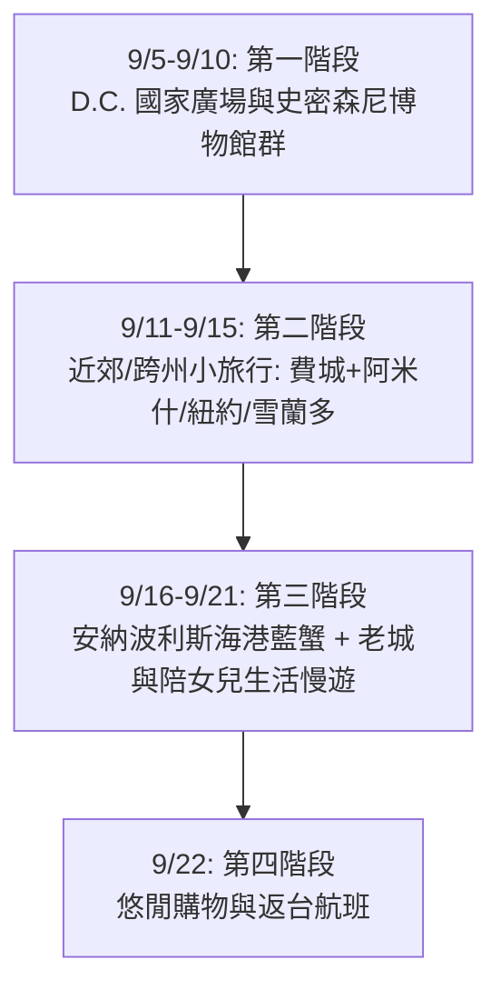

# 🇺🇸 華盛頓 D.C. 18天雙人探親旅遊完整規劃指南 (9/5 - 9/22)

這份規劃專為前往美國華盛頓 D.C. 探望女兒的夫妻雙人行設計。9 月初至 9 月中旬是華盛頓一年之中氣候最宜人的初秋季節（氣溫約 15°C ~ 27°C），涼爽且少雨，非常適合步行與戶外觀光。

---

## ✈️ 一、 機票搜尋與航班選擇指南 (9/5 - 9/22 專屬)

### 1. 航班基本資訊與時差
* **去程 (9/5 六)**：自台北 (TPE) 出發。因美東夏令時間比台灣慢 12 小時，加上跨越國際換日線，**9/5 當天傍晚即可抵達華盛頓**。
* **回程 (9/22 二)**：自華盛頓出發，跨越換日線，**於 9/23 (三) 傍晚抵達台北**。
* **主要目的地機場**：
  * **IAD (Dulles International Airport 杜勒斯國際機場)**：主要國際機場，離市區約 40 分鐘（捷運銀線 Silver Line 直通市區與 Arlington）。
  * **DCA (Ronald Reagan National Airport 里根國家機場)**：距離 D.C. 市中心最近（捷運 15 分鐘），主要為美籍國內線。

---

### 2. 四大熱門轉機航線與推薦方案

#### 方案 A：聯合航空 United Airlines（SFO 舊金山轉機 · 最具性價比與順暢度）
* **優點**：全程同一航空公司（TPE-SFO-IAD），行李條會一次印至華盛頓 IAD，轉機動線最簡潔明確。
* **參考航班時段**：
  * **去程 (9/5)**：`UA 872` TPE 09:50 出發 ➔ SFO 06:30 抵達（轉機時間約 2-2.5 小時）➔ `UA 2032` SFO 08:45 出發 ➔ IAD 17:00 抵達。
  * **回程 (9/22)**：`UA 2416` IAD 08:30 出發 ➔ SFO 11:15 抵達（轉機時間約 2.5 小時）➔ `UA 871` SFO 13:50 出發 ➔ TPE 18:30 (+1天 9/23 抵達)。
* **預估票價（來回雙人總價）**：
  * 經濟艙 (Economy)：約 NT$ 32,000 ~ 42,000 / 人
  * 豪華經濟艙 (Premium Economy)：約 NT$ 55,000 ~ 72,000 / 人

#### 🧳 專題解答：在舊金山 (SFO) 轉機的行李領取與直掛規定

根據美國國土安全局與海關 (CBP) 規定，**「入境」與「出境」美國的行李規定不同**，具體步驟如下：

##### 1. 去程（台北 TPE ➔ 舊金山 SFO ➔ 華盛頓 IAD）：【行李條直掛，但需在 SFO 拉出來過海關】
* **在台北 check-in 時**：聯合航空櫃檯會將行李條直接印上 `IAD`（華盛頓），這代表**行李目的地是華盛頓**。
* **抵達舊金山 (SFO) 時**：
  1. 下飛機後，先通過 **美國入境證件查驗 (Passport Control / ESTA)**。
  2. 走至轉機/行李提取區，**親自在行李轉盤上將行李拉出來**（此為美國法律規定所有國際入境旅客皆需過海關檢查）。
  3. 推著行李通過 **美國海關 (CBP Inspection)**。
  4. 一通過海關出口，右前方即為聯合航空的 **「轉機行李托運櫃檯 (Connecting Flights Baggage Drop)」**。
  5. 由於行李牌上已經印有 `IAD`，您只需將行李**交給工作人員放到傳送帶上即可**（無需重新辦理報到手續，只需 1 分鐘）。
  6. 接著走專用通道過安檢 (TSA)，前往國內線航廈搭乘至華盛頓的航班。

##### 2. 回程（華盛頓 IAD ➔ 舊金山 SFO ➔ 台北 TPE）：【真正全程直掛，SFO 完全不用拿行李】
* 回程自華盛頓 (IAD) 登機時，行李會直接託運至台北 (TPE)。
* 在舊金山 (SFO) 轉機時，**完全不需要提取行李**，直接步行至國際線登機門搭機返回台灣即可！

---

### 3. 艙等選擇與長途飛行舒適建議
* **豪華經濟艙 (Premium Economy - 強烈推薦)**：
  * 飛行時間長達 16~19 小時，豪經艙座椅寬度多 2~3 吋、椅背傾斜度更大、設有腿靠。
  * 免費托運行李升至 **2 件 23kg/人**（雙人共可攜帶 4 箱），且享有**優先登機與優先提領行李**權益。
* **加選優選座位 (Economy Plus / Extra Legroom)**：
  * 若選擇經濟艙，建議在訂票時加價 $100~$150 美金升級為第一排出口座位或腿部加寬座。

---

## 🏨 二、 住宿區域詳細評比與實體飯店推薦

前往華盛頓 D.C. 進行長達 18 天的探親與觀光，選擇合適的住宿區域與房型將大幅提升行程的舒適度。由於停留時間較長且有先生同行，建議優先考慮 **「安全第一、捷運便利、環境安靜」**，並可適度搭配 **「附設廚房與洗衣機的長住型公寓飯店 (Extended Stay / Sonder)」**。

### 1. 四大核心住宿區域評比表

| 區域名稱 | 環境與治安特點 | 交通便利度 | 適合對象 | 推薦飯店與長住品牌 |
| :--- | :--- | :--- | :--- | :--- |
| **Dupont Circle / Logan Circle** | D.C. 傳統高級住宅與大使館區，林立著樹蔭大道、紅磚房與藝廊，治安極佳 | 捷運紅線 (Dupont Circle 站)，可直達國會山莊與聯合車站 | 喜愛人文氣息、街區漫步與異國美食 | • **The Dupont Circle Hotel** (高質感精品) • **Tabard Inn** (百年歷史溫馨) • **Sonder at Dupont Circle** (服務式公寓) • **Residence Inn Dupont Circle** (含早餐廚房) |
| **Penn Quarter / Chinatown** | 緊鄰國家廣場 (National Mall)，絕大多數史密森尼博物館與餐廳皆在步行範圍內 | 捷運 **Metro Center** 與 **Gallery Place** 大站，多線交會，交通全 D.C. 最方便 | 首次造訪、希望節省交通時間 | • **Grand Hyatt Washington** (大型四星) • **Courtyard by Marriott Downtown** (新穎設施) • **Riggs Washington DC** (奢華質感) |
| **Arlington (Rosslyn / Crystal City)** *(維吉尼亞州)* | 位於波托马克河對岸，治安極優、街區乾淨。房價與飯店稅率比 D.C. 市區划算約 15%~25% | 捷運藍/橙/銀線。**Rosslyn 站銀線直達 IAD 機場**；搭乘 1 站即達 Georgetown（喬治城） | CP值高、喜歡安靜安全環境、欲節省房費 | • **Hyatt Centric Arlington** (Rosslyn 站口) • **Residence Inn Arlington Rosslyn** (長住廚房套房) • **Crystal Gateway Marriott** |
| **Bethesda** *(馬里蘭州)* | 馬里蘭州富裕住宅區，周邊擁有超過 200 家餐館與精緻超市 (Whole Foods, Trader Joe's) | 捷運紅線 (Bethesda 站) 直達市中心與國家動物園 | 喜愛安靜高級郊區生活品質 | • **AC Hotel by Marriott Bethesda** • **The Bethesdan Hotel (Hilton)** |

### 2. 18 天長住型房型評比：飯店 vs. 公寓式飯店
* **長住型套房飯店 (Residence Inn / Homewood Suites / Element)**：提供全套廚房（電磁爐、大冰箱、微波爐、洗碗機）、**每日免費熱早餐**與自助洗乾衣房。非常適合想自己做家鄉菜或長住的旅客。
* **酒店式服務公寓 (Sonder / Mint House)**：擁有獨立客廳、全套廚房與**房內專用洗乾衣機**，空間大、裝潢現代，充滿像家一樣的溫馨隱私感。

---

## 📅 三、 18 天詳細每日行程規劃

### 【第一階段】D.C. 國家廣場與核心史密森尼博物館群 (9/5 - 9/10)

#### Day 1 (9/5 五) | 抵達華盛頓 · 順應時差
* **下午/晚上**：抵達 IAD 機場，女兒接機或搭乘捷運銀線/Uber 至住處 check-in。
* **晚上**：晚餐簡單享用美式餐點或家常菜，早點休息調整時差。

#### Day 2 (9/6 六) | 國家廣場經典地標巡禮
* **上午**：【華盛頓紀念碑 Washington Monument】（可提前預約登頂展望台）➔ 遠眺【白宮 The White House】。
* **下午**：漫步至【二戰紀念碑 World War II Memorial】➔【反思池 Reflecting Pool】➔【林肯紀念堂 Lincoln Memorial】。
* **傍晚**：前往【潮汐湖 Tidal Basin】，欣賞【傑斐遜紀念堂 Jefferson Memorial】與夕陽陽光。
* **晚餐**：舊城區經典美式牛排館（如 *Old Ebbitt Grill*，D.C. 最古老的餐廳之一）。

#### Day 3 (9/7 日) | 史密森尼博物館日 (航太與自然歷史)
* **上午**：【美國國家航空航天博物館 National Air and Space Museum】（展示萊特兄弟飛機、阿波羅登月艙，**需提前預約免費入場券**）。
* **下午**：【國立自然歷史博物館 National Museum of Natural History】（觀賞 Hope Diamond 藍鑽與恐龍化石）。
* **傍晚**：國家藝廊外圍雕塑公園漫步。

#### Day 4 (9/8 一) | 國會大廈與國家藝廊
* **上午**：【美國國會大廈 U.S. Capitol】導覽（須提前預約入場）➔ 經地下通道前往【國會圖書館 Library of Congress】（全球最大圖書館，義大利文藝複興風格建築極其壯麗）。
* **下午**：【國家藝廊 National Gallery of Art】（分為西館古典藝術與東館現代藝術，收藏達文西、梵谷等大師名畫）。
* **晚餐**：Penn Quarter 現代美式或地中海餐廳。

#### Day 5 (9/9 二) | 美國歷史與非裔歷史文化
* **上午**：【國立美國歷史博物館 National Museum of American History】（了解美國文化、第一夫人禮服展）。
* **下午**：【國立非裔美國人歷史與文化博物館 NMAAHC】（D.C. 最熱門博物館之一，建築與展覽皆極具震撼力，**需提前預約**）。
* **晚上**：與女兒一同在家料理或前往附近街區酒吧/餐館享用精緻晚餐。

#### Day 6 (9/10 三) | 喬治城 (Georgetown) 歷史風情與河畔散步
* **上午**：造訪【喬治城大學 Georgetown University】校園（哥德式建築）與 M Street 精品街漫步。
* **下午**：享用著名 *Georgetown Cupcake* 甜點，並至 C&O 運河與波托马克河畔公園散步。
* **傍晚**：搭乘 Water Taxi（水上計程車）從喬治城前往【The Wharf 水岸碼頭】。
* **晚餐**：The Wharf 享用新鮮海鮮餐與蒸藍蟹。

---

### 【第二階段】近郊小旅行與跨州漫遊選單 (9/11 - 9/15)

#### 方案 A：費城 (Philadelphia) + 賓州 Lancaster 阿米什農莊 (Amish Country) 3天2夜（最推薦！）
* **9/11 (四)**：搭乘 Amtrak 火車至費城，參觀獨立廳 (Independence Hall)、自由鍾 (Liberty Bell)，品嚐 Philly Cheesesteak。
* **9/12 (五)**：租車前往賓州 Lancaster 郡，體驗無電力、無汽車的阿米什農莊文化 (The Amish Farm and House)、搭乘傳統黑頂馬車 (Amish Buggy Ride)，晚餐享用 *Shady Maple Smorgasbord* 豪華自助大餐。
* **9/13 (六)**：前往全美頂級植物園【長木花園 (Longwood Gardens)】，欣賞噴泉表演與溫室花卉，傍晚返回華盛頓。

#### 方案 B：紐約市 (New York City) 藝文快閃 3天2夜
* **9/11 - 9/13**：搭乘 Amtrak 火車約 3.5 小時直達紐約 Penn Station，遊覽百老匯音樂劇、中央公園與大都會博物館。

#### 方案 C：維吉尼亞自然風光（雪蘭多國家公園 Shenandoah National Park）2天1夜
* **9/14 (日) - 9/15 (一)**：自駕約 1.5 小時前往 Shenandoah 天際線公路 (Skyline Drive)，欣賞初秋山谷景色與輕度步道健行。

---

### 【第三階段】深度人文、特色小鎮與陪女兒生活慢遊 (9/16 - 9/21)

#### Day 12 (9/16 二) | 亞歷山大老城 (Old Town Alexandria)
* **上午/下午**：搭乘捷運或 Water Taxi 前往維吉尼亞州的 Old Town Alexandria，漫步於 18 世紀紅磚小巷、逛獨特手作小店、參觀 King Street 歷史街區與 Torpedo Factory 藝術中心。

#### Day 13 (9/17 三) | 國立建築博物館與 Dupont Circle 藝文日
* **上午/下午**：參觀【國立建築博物館 National Building Museum】與【菲利普美術館 The Phillips Collection】，午後在 Dupont Circle 附近的使館街 (Embassy Row) 散步。

#### Day 14 (9/18 四) | 國家印第安人博物館與植物園
* **上午/下午**：造訪【美國國立植物園 United States Botanic Garden】與【國立美國印第安人博物館】，並在 Mitsitam Café 享用全美原住民風味特色美食。

#### Day 15 (9/19 五) | 國家檔案館與國際間諜博物館
* **上午/下午**：在【國家檔案館 National Archives】親眼目睹《美國獨立宣言》原件，下午前往【國際間諜博物館 International Spy Museum】感受互動式樂趣。

#### Day 16 (9/20 六) | 安納波利斯 (Annapolis) 馬里蘭州府與海鮮一日遊
* **全天**：驅車前往馬里蘭州首府【Annapolis（安納波利斯）】（車程約 45 分鐘），參觀美國海軍官校、海港風情與紅磚老街，享用著名的馬里蘭清蒸藍蟹 (Steamed Blue Crab)。（詳見第四章專題）

#### Day 17 (9/21 日) | 悠閒購物與女兒告別晚餐
* **上午/下午**：前往【Tysons Corner Center】採買伴手禮與禮品。晚上與女兒享用溫馨的告別晚餐。

---

### 【第四階段】圓滿返程 (9/22)

#### Day 18 (9/22 一) | 搭機返台
* **上午**：享用悠閒早餐，檢查隨身物品與護照。
* **下午**：前往 IAD 機場辦理登機與行李託運，搭機返回台灣。

---

## 🦀 四、 深度特輯：安納波利斯海港風情與清蒸藍蟹指南

安納波利斯 (Annapolis) 距離 D.C. 僅 45 分鐘車程，被譽為**「美國帆船之都」**。

### 1. 必遊景點
* **美國海軍官校 (U.S. Naval Academy)**：憑護照進入，參觀美輪美奐的法式哥德建築、主教堂 (USNA Chapel) 與 John Paul Jones 石棺陵寢。
* **馬里蘭州議會大廈 (Maryland State House)**：全美現存最古老且仍在使用中的州議會大廈，曾短暫作為美國首都。
* **城市碼頭 (City Dock) 與「Ego Alley」**：坐在碼頭邊觀賞豪華帆船與遊艇停泊，享受海港風光。

### 2. 正宗「馬里蘭清蒸藍蟹」美食文化
* **Old Bay 辛香料厚蒸**：藍蟹活體直接撒上厚厚一層由芹菜籽、黑胡椒、辣椒粉組成的 Old Bay 辛香料，加入蘋果醋與啤酒大鍋大火蒸熟，外殼鹹香帶辣，蟹肉極度鮮甜。
* **豪邁敲蟹體驗**：桌上鋪滿棕色牛皮紙，發給每人一把**小木槌 (Wooden Mallet)** 與小刀，親手敲開蟹殼、剝去蟹鰓，抓著鮮嫩蟹肉搭配冰鎮啤酒享用！

### 3. 嚴選餐廳推薦
* **Cantler's Riverside Inn（首選推薦！）**：位於安納波利斯郊區水邊，漁船直接停靠後方碼頭卸貨。木質大圓桌、戶外露天座，充滿濃濃美式鄉村漁港風情。
* **Boatyard Bar & Grill（最讚蟹餅 Crab Cake）**：被譽為全美最好吃的馬里蘭蟹餅，由高達 90% 以上的全塊鮮蟹肉微煎而成，口口鮮甜。

---

## 🚜 五、 深度特輯：賓夕法尼亞州 Lancaster 阿米什農莊 (Amish Country)

從 D.C. 驅車向北約 2 小時，即可抵達賓州 Lancaster，體驗全美規模最大的阿米什人 (Amish) 聚落。

### 1. 生活文化背景
* 阿米什人拒絕現代電力網、汽車、電視與智慧型手機，過著 18 世紀簡樸純真的農耕生活。路上隨處可見黑頂馬車 (Buggy)、傳統風車與風情萬種的木造覆蓋橋。

### 2. 必體驗亮點
* **The Amish Farm and House 導覽**：走進真實阿米什住宅，了解無電生活與教育文化。
* **Amish Buggy Ride 馬車體驗**：搭乘黑頂馬車穿過風車與田園小路。
* **Shady Maple Smorgasbord 豪華自助餐**：全美最大自助餐廳，品嚐道地阿米什家常菜、現烤牛肉與甜點。
* **特色小吃與手工藝**：品嚐 Shoofly Pie（糖蜜派）、Soft Pretzel，觀賞國寶級手工拼布被 (Quilts)。

> 🚫 **參觀禮儀與禁忌（極重要）**：
> 1. **切勿正對阿米什人面部拍照**：宗教教義禁止刻劃個人肖像，請勿拿相機對著他們（尤其是兒童）近拍。
> 2. **週日全體公休**：阿米什店家與農夫市場在星期日不營業，請安排於週四、五、六前往。

---

## 🎟️ 六、 熱門景點免費預約指南

1. **航太博物館 (National Air and Space Museum - Mall 展館)**：需提前約 30 天於官網搶免費定時入場券。
2. **非裔美國人歷史文化博物館 (NMAAHC)**：需提前預約免費定時入場券。
3. **華盛頓紀念碑登頂 (Washington Monument)**：需提前至 Recreation.gov 預約登頂門票（手續費 $1 美金）。
4. **國會大廈與國會圖書館**：建議提前於官網預約免費導覽時段。

---

## 💡 七、 行前準備與實用建議

1. **美國簽證 (ESTA)**：請於出發前 **至少 72 小時** 至 ESTA 官網申請電子旅行授權（費用 $21 美金/人，效期 2 年）。
2. **氣候與穿著**：九月白天約 24°C ~ 28°C，早晚約 15°C ~ 18°C。建議採「洋蔥式穿法」，並準備極為舒適的 **步行鞋/運動鞋**。
3. **當地交通與支付**：手機可直接新增 **SmarTrip 虛擬卡** 感應搭乘捷運與公車；準備 1~2 張海外刷卡回饋高的信用卡（多數店家實施無現金支付）。
